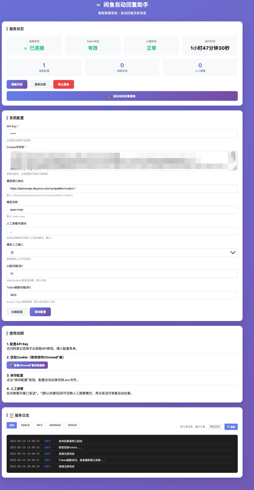
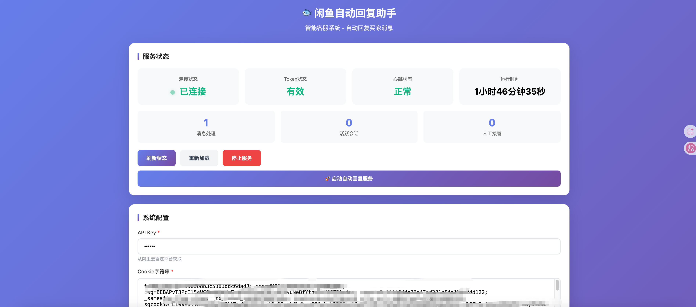
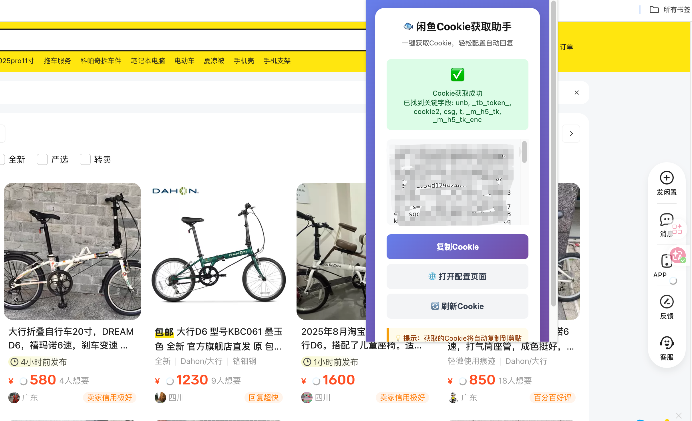
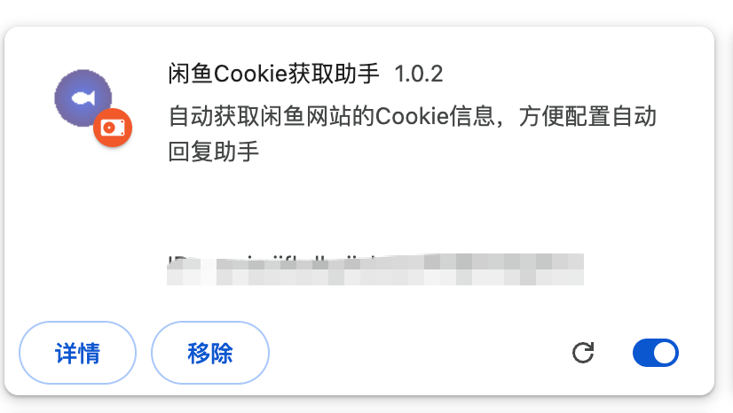
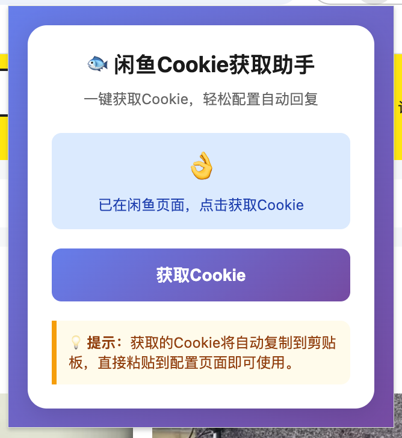

# 🚀 Xianyu AutoAgent - 智能闲鱼客服机器人

[](https://www.python.org/)
[](LICENSE)

基于大语言模型的智能闲鱼客服机器人，实现 7×24 小时自动化值守，支持多专家协同决策、智能议价和上下文感知对话。
可视化参数、状态管理、日志记录等功能，方便用户监控和管理服务运行。
提供便捷的chrome插件，一键获取闲鱼cookie，无需手动配置。

## 界面预览

### Web 管理端

<div align="center">
  
  
  <br>
  <em>图1: Web 管理端 - 配置管理、状态监控、日志查看</em>
</div>

### Chrome 插件

<div align="center">
  
  <br>
  <em>图2: Chrome 插件 - Cookie 一键获取</em>
</div>
<div align="center">
  
  <br>
  <em>图2: Chrome 插件 - Cookie 一键获取</em>
</div>
<div align="center">
  
  <br>
  <em>图2: Chrome 插件 - Cookie 一键获取</em>
</div>

## 🎨效果图

<div align="center">
  
  
  
  <br>
  <em>效果图</em>
</div>

## 核心特性

### 多专家协同系统

| 专家角色 | 职责场景 | 核心能力                  |
| ---- | ---- | --------------------- |
| 分类专家 | 意图识别 | LLM + 规则双轨路由，精准分发咨询类型 |
| 议价专家 | 价格谈判 | 阶梯降价策略，根据议价次数动态调整优惠   |
| 技术专家 | 参数咨询 | 产品规格、型号对比、使用指导等技术支持   |
| 默认专家 | 通用回复 | 物流、售后、使用体验等日常问题解答     |

### 智能路由引擎

采用三级路由策略，保证响应准确性：

1. **关键词预检** - 技术类词汇优先匹配
2. **正则模式匹配** - 价格、对比等模式精准识别
3. **LLM 兜底分类** - 复杂语境由大模型判断

### 上下文管理

- SQLite 持久化存储对话历史
- 按用户 ID + 商品 ID 隔离会话
- 支持议价次数追踪

### 安全过滤

- 自动屏蔽微信、QQ、支付宝等敏感词
- 线下交易风险提示
- 消息安全过滤模块

## 技术架构

```
┌─────────────────────────────────────────────────────┐
│                    WebSocket 客户端                   │
│                  (接收买家消息)                       │
└─────────────────────┬───────────────────────────────┘
                      │
┌─────────────────────▼───────────────────────────────┐
│              XianyuReplyBot 核心引擎                  │
│  ┌─────────┐  ┌─────────┐  ┌─────────┐  ┌─────────┐ │
│  │分类专家  │  │议价专家  │  │技术专家  │  │默认专家  │ │
│  └────┬────┘  └────┬────┘  └────┬────┘  └────┬────┘ │
│       └────────────┴────────────┴────────────┘      │
│                         │                            │
│              ┌──────────▼──────────┐                │
│              │    IntentRouter    │                │
│              │      意图路由       │                │
│              └──────────┬──────────┘                │
└─────────────────────────┼────────────────────────────┘
                          │
         ┌────────────────┼────────────────┐
         │                │                │
         ▼                ▼                ▼
   ┌──────────┐    ┌──────────┐    ┌──────────┐
   │上下文管理 │    │  LLM API │    │安全过滤  │
   │  SQLite  │    │(通义千问等)│    │          │
   └──────────┘    └──────────┘    └──────────┘
```

### 技术栈

- **运行时**: Python 3.8+
- **AI 能力**: OpenAI SDK（兼容通义千问、DeepSeek 等主流 API）
- **实时通信**: WebSocket
- **数据存储**: SQLite
- **Web 服务**: Flask
- **部署**: Docker / Docker Compose

## 快速开始

### 环境要求

- Python 3.8+

### 安装步骤

```bash
# 克隆仓库
git clone https://github.com/skyflybird86/xianyu-auto-agent.git
cd xianyu-auto-agent

# 安装依赖
pip install -r requirements.txt

# 复制环境变量模板
cp .env.example .env
```

### 配置说明

编辑 `.env` 文件，填入以下配置：

```env
# 必填配置
API_KEY=你的API密钥
MODEL_BASE_URL=模型API地址
MODEL_NAME=模型名称
COOKIES_STR=闲鱼网页Cookie
XIANYU_URL=闲鱼消息WebSocket地址
XIANYU_WS_URL=闲鱼WebSocket地址

# 可选配置
TOGGLE_KEYWORDS=接管模式切换关键词（默认句号）
SIMULATE_HUMAN_TYPING=True/False
```

### 运行

```bash
python main.py
```

### 提示词自定义

编辑 `prompts/` 目录下的文件可自定义各专家的行为：

- `classify_prompt.txt` - 分类专家提示词
- `price_prompt.txt` - 议价专家提示词
- `tech_prompt.txt` - 技术专家提示词
- `default_prompt.txt` - 默认回复提示词

## Docker 部署

```bash
# 构建镜像
docker build -t xianyu-auto-agent .

# 启动容器
docker-compose up -d
```

## 项目结构

```
XianyuAutoAgent-main/
├── main.py                 # 程序入口
├── XianyuAgent.py          # 核心Agent引擎
├── XianyuApis.py           # 闲鱼API封装
├── context_manager.py      # 上下文管理器
├── web_server.py           # Web服务
├── prompts/                # 提示词配置
│   ├── classify_prompt.txt
│   ├── price_prompt.txt
│   ├── tech_prompt.txt
│   └── default_prompt.txt
├── utils/                   # 工具函数
├── chrome-extension/        # Chrome扩展（可选）
├── Dockerfile
├── docker-compose.yml
└── requirements.txt
```

## 注意事项

⚠️ 本项目仅供学习与交流使用，请勿用于商业违规场景。

如有问题或建议，请联系：[66018099@qq.com](mailto:coderxiu@qq.com)

## License

MIT License
